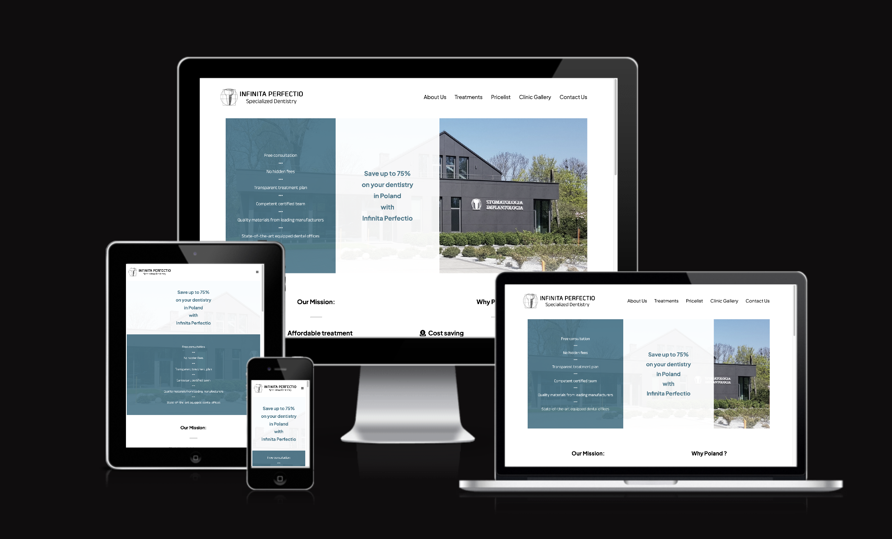

# Infinita Perfectio Overview

The Infinita Perfectio website was designed for a Polish dental clinic with an aim of advertising the clinic and attracting international customers. While browsing the website, a potential customer will learn about the history of the clinic and what dental treatments are offered at the clinic. In a very clear way, the website presents the advantages of obtaining dental treatments in Poland and the prices of specific treatments. The customer also has the opportunity of sending an inquiry via the Contact Us form available on the website.

## Features

- __Navigation Bar__

  - Navigation bar features on all pages, allowing the user to easily navigate between pages across all devices without the need to revert back to the previous page via the “back” button.
  - The navigation bar includes links to the Home Page, About Us, Treatments, Price list, Clinic Gallery and Contact Us page and is identical on all pages.

  
- __The landing page__

  - The landing page introduces the user to Infinita Perfectio clinic and outlines the benefits of obtaining dental treatments at the Polish based clinic.

  - The potential cost savings paragraph is included at the top of the page to grab users attention and encourage to continue browsing.

  - The description of arranging and receiving dental treatment in Poland is outlined in a four simple steps at the bottom of the page.

  

Insert Screenshot here

  
- __About Us__

  - This page introduces the user to Doctor Pawel Zimny, the founder of the Infinita Perfectio clinic. It outlines Pawel’s medical education and post graduate training he received. The aim of this section is to assure the client that the services provided by the clinic are at the highest level.

  

Insert Screenshot here

  
- __Treatments__

  - The page outlines types of dental treatments the clinic offers and includes a short description of each treatment so the users can familiarize themselves with treatments they might wish to undergo.

Insert Screenshot here

- __Price List__

  - This page lists prices of treatments offered by the clinic. For easier access, the prices are divided into specific categories.

  - The aim of this page is to provide clear and transparent pricing to encourage the user to proceed with the treatment.

 
Insert Screenshot here

  - __Clinic Gallery__
  

    - The Clinic Gallery page allows the user to see the interior of the clinic and particular treatment rooms.

    - This section might be valuable to the users who wish to familiarize themselves with the clinic prior to their appointments.

  
Insert Screenshot here

  
- __Contact Us__

  - This page allows the user to easily contact the clinic through an interactive Contact Form. In order to submit the form, the user will be asked to provide their name and email address.

  - The email address, phone number and Google Maps embedded i-frame is also included on the page.

 
Insert Screenshot here

  
- __The Footer__

  - The Footer bar features on all pages, allowing the user to easily access the Privacy Policy page, Facebook page of the clinic, make a phone call through WhatsApp or switch to the Contact Us page.

  
- __Privacy Policy__

  - The Privacy Policy page defines the principles of storing, accessing, collecting and processing data. It also outlines the rights and obligations of users utilizing the website.

Insert Screenshot here

  
## Testing

  

During the development process I encountered various bugs and performance related problems and conducted substantial number of testing.

  

Goals / Features

In my opinion all features of the page work as intended achieving the goals of the project i.e. the introduction of the user to Infinita Perfectio and allowing him or her to easily obtain all key information on arraigning dental treatment in Poland. The pages also encourages the user to contact the clinic by incorporating contact links on the pages.

  

1 Navigation Bar

Navigation bar is displayed identically on all pages and links to other pages are working correctly. Upon clicking on the logo icon in the left upper corner of the page, the user is redirected to the landing page.

  

2 Landing page, About Us, Treatments and Clinic Gallery

The text description is displayed evenly on the pages and in a way it was intended too.

  

The color background is displayed correctly and evenly.

  

The photos are placed evenly on the page??

  

3 Price list

The listing is displayed correctly and evenly. The interactive heading sections pf the listing expanding correctly upon clicking.

  

4 Contact Us

The interactive form works correctly by notifying if the required files are left empty.

The submit button works correctly ???

The submission of form returns correct acknowledgement notification. ??

The interactive links to the email, WhatsUp and Facebook are working correctly.

  

How works and displays on various browsers and screen sizes ????

  

Mention few interesting bugs and problems you discovered during testing ???

  

Validation Testing

HTML

No errors were returned when passing through the official xxx link here?

  

CSS

No errors were returned when passing through the official xxxx link validator

  

Unfixed Bugs - Zbyszek

  

  

#### Deployment ???

  

#### Credits

  

Content

  

The content text for the page was partly provided by the clinic owner Dr Pawel Zimny. Party provided by xxxx?

  

The font ?

The navigation bar?

The footer ?

Repositories ?

Tutorials ?

  

Media

The photos used on Treatments and Price List pages were taken from xx

  

The photos of the clinic and photos featuring Dr Pawel Zimny were provided by him personally.

  

The logo of the clinic was proceder by Dr Pawel Zimny.