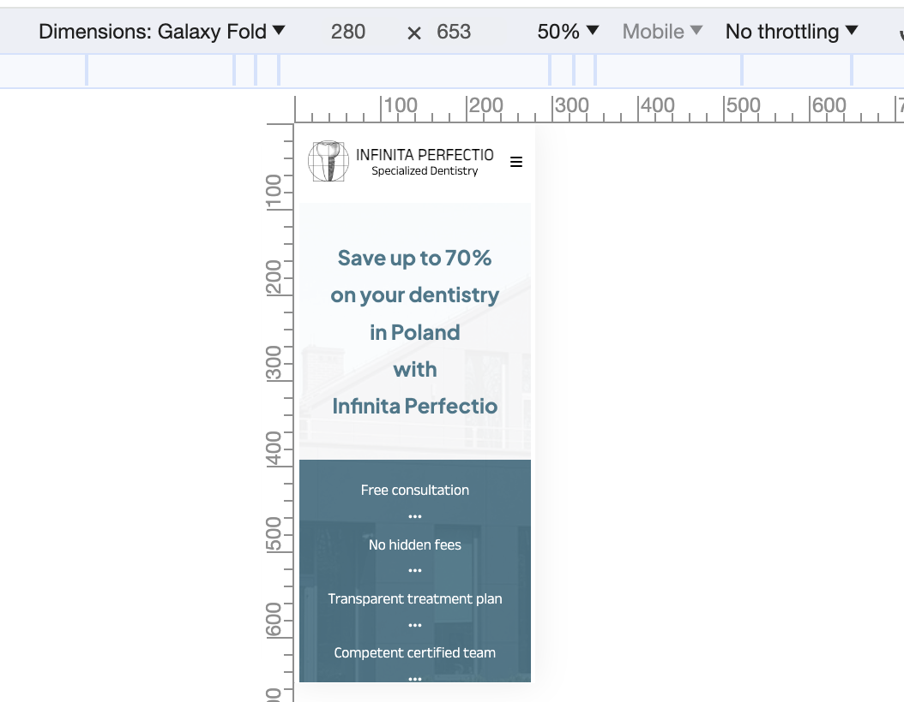
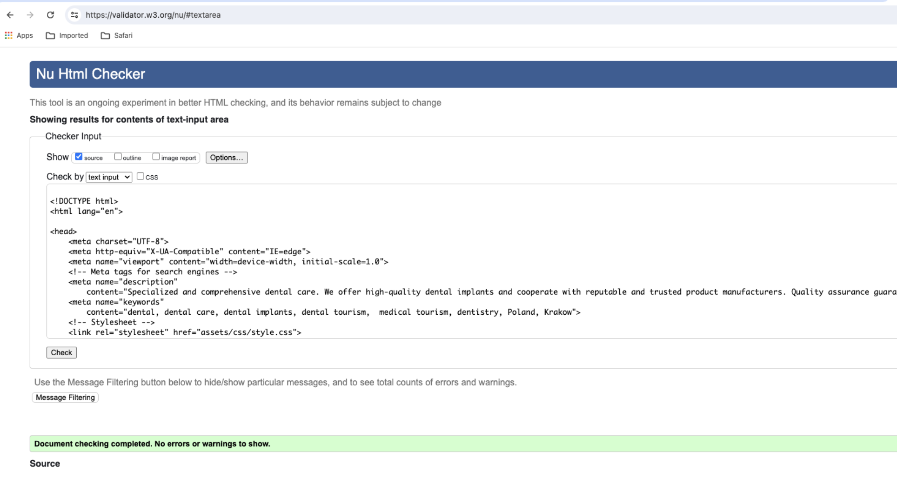

# Infinita Perfectio Overview

The Infinita Perfectio website was designed for a Polish dental clinic with an aim of advertising the clinic and attracting international customers. While browsing the website, a potential customer will learn about the history of the clinic and what dental treatments are offered at the clinic. In a very clear way, the website presents the advantages of obtaining dental treatments in Poland and the prices of specific treatments. The customer also has the opportunity of sending an inquiry via the Contact Us form available on the website.

Link to the hosted project [Infinita Perfectio](https://zbigniewszulc.github.io/infinita-perfectio/)

- [Infinita Perfectio Overview](#infinita-perfectio-overview)
  - [Features](#features)
  - [Testing](#testing)
    - [Goals/Features](#goalsfeatures)
    - [Validation Testing](#validation-testing)
  - [Deployment](#deployment)
  - [Credits](#credits)
    - [Content](#content)
    - [Media](#media)
      - [Images](#images)
      - [Google Map](#google-map)
      - [Icons](#icons)
    - [Form handling](#form-handling)
    - [HTML \& CSS](#html--css)
    - [Accessibility](#accessibility)
    - [Typography](#typography)
    - [Translation](#translation)
    - [Fonts](#fonts)
    - [Favicon](#favicon)
    - [GDPR/RODO](#gdprrodo)
    - [UX Website Design Principles](#ux-website-design-principles)

## Features

- __Navigation Bar__

  - Navigation bar features on all pages, allowing the user to easily navigate between pages across all devices without the need to revert back to the previous page via the “back” button.
  - The navigation bar includes links to the Home Page, About Us, Treatments, Price list, Clinic Gallery and Contact Us page and is identical on all pages.

  
- __The landing page__

  - The landing page introduces the user to Infinita Perfectio clinic and outlines the benefits of obtaining dental treatments at the Polish based clinic.

  

  - The potential cost savings paragraph and benefits are included at the top of the page to grab users attention and encourage to continue browsing.

  - The description of arranging and receiving dental treatment in Poland is outlined in a four simple steps at the bottom of the page.

  

  
- __About Us__

  - This page introduces the user to Doctor Pawel Zimny, the founder of the Infinita Perfectio clinic. It outlines Pawel’s medical education and post graduate training he received. The aim of this section is to assure the client that the services provided by the clinic are at the highest level.

  

Insert Screenshot here

  
- __Treatments__

  - The page outlines types of dental treatments the clinic offers and includes a short description of each treatment so the users can familiarize themselves with treatments they might wish to undergo.

- __Price List__

  - This page lists prices of treatments offered by the clinic. For easier access, the prices are divided into specific categories.

  - The aim of this page is to provide clear and transparent pricing to encourage the user to proceed with the treatment.

 

  - __Clinic Gallery__
  

    - The Clinic Gallery page allows the user to see the interior of the clinic and particular treatment rooms.

    - This section might be valuable to the users who wish to familiarize themselves with the clinic prior to their appointments.

  

  
- __Contact Us__

  - This page allows the user to easily contact the clinic through an online Contact Form. In order to submit the form, the user will be asked to provide at least their name and email address.

  - The clinic's email address, phone number, and embedded Google Maps iframe are also provided as an alternative contact option. This will allow the potential patient to select any preferred contact option and find out where the clinic is located.

 

  
- __The Footer__

  - The Footer bar features on all pages, allowing the user to easily access the Privacy Policy page, Facebook page of the clinic, make a phone call through WhatsApp or switch to the Contact Us page.

- __Privacy Policy__

  - The Privacy Policy page defines the principles of storing, accessing, collecting and processing data. It also outlines the rights and obligations of users utilizing the website.

  
## Testing

 Throughout the development process, I encountered various bugs and performance-related issues, prompting me to conduct a substantial number of tests. In the sections below, I examined different features with the aim of achieving specific goals. For instance, I verified whether the submit button successfully submits the form and if clicking on a link opens it, among other tests.

### Goals/Features

1. Navigation bar

  - The navigation hamburger on the website has the function of hiding the navigation menu in one icon as three horizontal bars, which saves screen space  on tablets and mobile devices. When hamburger icon clicked, a full menu expands, allowing users to more easily access different sections of the page, i.e. About Us, Treatments, Pricelist, Clinic Gallery, Contact Us. When the hamburger menu is clicked again, it should toggle the menu to its previous state.

  - Navbar toggles when clicking on hamburger menu 
  

  - Navbar comes back to previous state when hamburger icon clicked again.

   

  On tablets the behavior is the same as on mobile devices. This is expected.
  This functionality was tested using Google Chrome DevTools with different resolution options. Additionaly tested on private devices: /tablets/mobiles/laptops/PC's.

| Was the test performed successfully? | Yes |
|--------------------------------------|-----|

2. Landing page

Besides providing encouraging information to consider medical tourism, the website includes a banner that should be displayed in a vertical position for mobile devices and should be layout in a two-column layout when viewed on tablets. It is expected that the banner section of the page will appropriately adjust its layout for a vertical orientation. Let's test this!

| Was the test performed successfully? | Yes |
|--------------------------------------|-----|

3. About Us, Treatments and Clinic Gallery
  
  - The main purpose of the above pages is to provide comprehensive information about the clinic, the range of treatments it offers and the general atmosphere of the facility.

  - We perform tests on these pages to ensure that all images and descriptions load correctly. We will also simulate a situation in which the images cannot be loaded that alternative text (alt text) is displayed. Alt text mainly serves as an alternative for people who cannot see an image, whether due to browser settings, problems loading images, or other limitations.

  

| Was the test performed successfully? | Yes |
|--------------------------------------|-----|

3. Pricelist

  - The purpose of this page is to transparently provide information about the prices offered by the clinic. For clarity, the information has been grouped to make the page more readable and understandable. The functionality that facilitates this solution is the use of details-summary tags to create a disclosure widget. Visually, it appears as a collapsible section. In this case, we are testing on various devices to ensure that this functionality works as expected. 
  We anticipate that, upon clicking the arrow, the list of offered prices will expand. Once opened, the list should not close automatically. The goal is to allow users an easy preview of all options in the price list if they wish

    

    

    | Was the test performed successfully? | Yes |
    |--------------------------------------|-----|

4. Contact Us

 - On this page, form validation will be tested. We need to ensure that:
    - Required fields are filled out before the form can be submitted. If not, the user should receive information prompting them to complete the field

    

    - The email field contains a valid email address. If not, the user should be notified with an appropriate message.

    

    - The Privacy Policy link opens to allow the user to familiarize themselves with their rights.

    

    - After clicking the Submit button, the form should be handled by https://formdump.codeinstitute.net.

    

### Validation Testing 

- HTML

https://validator.w3.org/ -  is the web address for the W3C Markup Validation Service. The W3C Markup Validation Service is a tool provided by the World Wide Web Consortium (W3C) that allows web developers to check and validate the markup (HTML, XHTML, etc.) of web documents.

I used the above scanner to scan the source code of all pages, i.e. Landing Page, About Us, Treatments, Pricelist, Clinic Gallery, Contact Us and Privacy Policy. The following errors were found: 

- Landing Page

 1. First Iteration

 | Error                                                                                                           | Line                                             | Fix     | Resolved |
|-----------------------------------------------------------------------------------------------------------------|--------------------------------------------------|---------|----------|
| Trailing slash on void elements has no effect and interacts badly with unquoted attribute values                | From line 106, column 25; to line 106, column 28 | Applied | Yes      |
| End tag a violates nesting rules                                                                                | From line 106, column 25; to line 106, column 28 | Applied | Yes      |
| Element div not allowed as child of element ol in this context. (Suppressing further errors from this subtree.) | From line 195, column 25; to line 195, column 42 | Applied | Yes      |
| Stray end tag i.                                                                                                | From line 238, column 67; to line 238, column 70 | Applied | Yes      |

2. Second iteration 

| Error                                                                                                          | Line                                             | Fix     | Resolved |
|----------------------------------------------------------------------------------------------------------------|--------------------------------------------------|---------|----------|
| Element i not allowed as child of element ul in this context. (Suppressing further errors from this subtree.)  | From line 72, column 21; to line 72, column 49   | Applied | Yes      |
| Element h2 not allowed as child of element ol in this context. (Suppressing further errors from this subtree.) | From line 202, column 29; to line 202, column 32 | Applied | Yes      |

<ins>Evidence:</ins>

- About Us Page 

1. First Iteration

| Error                                                                                                                   | Line                                             | Fix     | Resolved |
|-------------------------------------------------------------------------------------------------------------------------|--------------------------------------------------|---------|----------|
| Element figcaption not allowed as child of element div in this context. (Suppressing further errors from this subtree.) | From line 66, column 21; to line 66, column 32   | Applied | Yes      |
| Stray end tag i.                                                                                                        | From line 122, column 67; to line 122, column 70 | Applied | Yes      |

<ins>Evidence: </ins>

- Pricelist Page

1. First Iteration 

| Error                                                      | Line                                             | Fix     | Resolved |
|------------------------------------------------------------|--------------------------------------------------|---------|----------|
| Attribute alt not allowed on element source at this point. | From line 66, column 21; to line 66, column 108  | Applied | Yes      |
| Stray end tag i                                            | From line 303, column 67; to line 303, column 70 | Applied | Yes      |

<ins>Evidence:</ins>

There was also a warning `Section lacks heading. Consider using h2-h6 elements to add identifying headings to all sections, or else use a div element instead for any cases where no heading is needed` - this is fixed too.

- Gallery Page

1. First Iteration

| Error                                                                                                                                                                         | Line                                           | Fix     | Resolved |
|-------------------------------------------------------------------------------------------------------------------------------------------------------------------------------|------------------------------------------------|---------|----------|
| Section lacks heading. Consider using h2-h6 elements to add identifying headings to all sections, or else use a div element instead for any cases where no heading is needed. | From line 62, column 9; to line 62, column 30  | Applied | Yes      |
| Stray end tag i                                                                                                                                                               | From line 88, column 67; to line 88, column 70 | Applied | Yes      |

<ins>Evidence:</ins>

- Privacy Policy Page

1. First Iteration

| Error                                                                                                          | Line                                             | Fix     | Resolved |
|----------------------------------------------------------------------------------------------------------------|--------------------------------------------------|---------|----------|
| No p element in scope but a p end tag seen.                                                                    | From line 363, column 17; to line 363, column 20 | Applied | Yes      |
| Element ul not allowed as child of element ul in this context. (Suppressing further errors from this subtree.) | From line 615, column 25; to line 615, column 28 | Applied | Yes      |
| Stray end tag i                                                                                                | From line 828, column 67; to line 828, column 70 | Applied | Yes      |

<ins>Evidence:</ins>

- CSS

For validation purpose [W3C CSS Validator](https://validator.w3.org) were used. 
The W3C CSS Validator is a tool provided by the World Wide Web Consortium (W3C) to check and validate Cascading Style Sheets (CSS). The W3C CSS Validator helps web developers ensure that their CSS code follows the official specifications and standards set by the W3C. 

I used the above validator to scan the style.css file located in the assets/css/style.css file tree and the following issues were detected:

- 530 #google-maps-wrapper Value Error : max-height auto is not a max-height value : auto
    - This has been fixed by changing `max-height: auto;` to `max-height: 100%;` 
     
- 885 #email-call-map-wrapper Value Error : margin-bottom only 0 can be a unit. You must put a unit after your number : -200
    - it was typo issue. Has been fixed by adding `px` unit to -200.

The second verification scan passed:

- Lightouse testing

    - Landing page
    
    - About Us
    
    - Treatments
    
    - Pricelist
    
    - Clinic Gallery
    
    - Contact Us
    
    - Privacy Policy 
    

- Accessibility Evaluation

    Aaccessibility testing was performed using the Wave website - evaluation tool: 

    1. First iteration result:

    

    2. Second iteraition results:

    

## Deployment

To manage the source code history, Git, a version control system, has been utilized. GitHub, one of the most popular hosting services for Git repositories, was chosen. Creating an account is quick and straightforward. Additionally, GitHub provides a service called GitHub Pages, allowing the source code of a project to be linked. This enables the remote presentation of project results to end-users. This is an ideal solution for this project, as it is being carried out for a business operating internationally. Furthermore, changes to the source code are practically visible to end-users with minimal delays.

Procedure for implementing the source code into GitHub Pages:

1. Log in to GitHub at https://github.com.
2. Navigate to the project repository. Usually, after logging in, it should be visible in the "Top Repositories" section without the need for further navigation. If not, repositories can always be viewed by clicking on avatar and selecting the "Your repositories" option"

3. After selecting the repository, find the settings button and go to the Pages tab

4. Make sure the source section is marked “deploy from a branch” and branch to “main” in the root folder. Press the “Save” button.

5. That's it. After waiting a while for the project hosting service to be created, a link to the project should appear.

## Credits
### Content

Page content has been partially provided by the clinic owner and partially authored by me. The owner supplied substantive content, while I focused on constructing the section highlighting the benefits of medical tourism. This approach was chosen for several reasons: a short project timeline, the owner's limited time to provide all materials, and my personal experience with medical tourism, including dental tourism. In such a case, it is easier for the owner to edit a previously prepared text. This not only allows for easy modification but also opens up the possibility of refining the project overview and tailoring it to specific needs.

The content provided by the clinic owner is based on an existing website addressed to local patients - https://www.implanty-bielsko.pl

### Media

#### Images
The photos of the clinic and photos featuring Dr Pawel Zimny were provided by him personally. These are the following photos:
  - landing-page-clinic.webp
  - infinita-perfectio-clinic-front.webp
  - dr-zimny.webp (thumbnail)
  - dr-pawel-zimny-vienna1.webp
  - dr-pawel-zimny-vienna2.webp
  - infinita-perfectio-hallway.webp
  - infinita-perfectio-reception.webp
  - infinita-perfectio-room1-hallway.webp
  - infinita-perfectio-room1.webp
  - infinita-perfectio-room2-hallway.webp
  - infinita-perfectio-room2.webp
  - infinita-perfectio-logo.webp

  The images used on Treatments and Price List pages were taken from [Pixabay](https://pixabay.com) and [Pexels](https://www.pexels.com) respectively: 
  - Pixabay :
    - dental-hygiene-thumbnail.webp
    - smiley-face-large.webp
    - smiley-face-mobile.webp
    - smiley-face-tablet.webp

  - Pexels
    - endodontics-thumbnail.webp 
    - prosthodontics-thumbnail.webp
    - dental-implants-thumbnail.webp
    - dental-surgery-thumbnail.webp
    - general-dentistry-thmbnail.webp
    - privacy-policy-hero.webp
  
#### Google Map

The clinic location iframe on the "Contact Us" page was taken from a publicly available Google Maps share link.

#### Icons 

Landing page, contact us and footer utilize embedded font taken from [Font Awesome](https://fontawesome.com/)

### Form handling

The online form located on Contact Us page is handled by [codeinstitute.net](https://formdump.codeinstitute.net)

### HTML & CSS

Most of the learning materials and clues were inspired by the following sites:
 - [w3schools](https://www.w3schools.com/css/default.asp)
 - Code Institute Learning Platform [LMS](https://learn.codeinstitute.net/)
 - Mozilla Web Docs - Documentation for Web developers [developer.mozilla.org](https://developer.mozilla.org/)
 - [css-tricks.com](https://css-tricks.com)
 - How to make image responsive [www.freecodecamp.org](https://www.freecodecamp.org/news/css-responsive-image-tutorial/#:~:text=To%20make%20an%20image%20responsive,than%20absolute%20ones%20like%20pixels.)
 - Resize images for responsive web design [www.wix.com](https://www.wix.com/studio/blog/resize-image-css)
 - [caniuse.com](https://caniuse.com)
 - [web.dev](https://web.dev/)
 - Importance of using aria-label [www.aditus.io](https://www.aditus.io/aria/aria-label/#:~:text=a%20new%20tab\))

### Accessibility
  - Redundant link explanation [app.pope.tech](https://app.pope.tech/result-documentation/articles/redundant-link)
 
 
### Typography

- Web Typography [www.toptal.com](https://www.toptal.com/designers/typography/web-typography-infographic#:~:text=The%20font%20size%20on%20a,on%20a%20desktop%20computer%20screen.)

### Translation

- In order to translate some complicated medical terms, Google Translator or Chat GPT was used alternately.

### Fonts 

  - Helps you choose best font [wordmark.it](https://wordmark.it)
  - [Google Fonts](https://fonts.google.com)

### Favicon
 - Used to generate favicon [redketchup.io](https://redketchup.io/favicon-generator)

### GDPR/RODO
- What is RODO/The GDPR [dtmates.com](https://dtmates.com/wp-content/uploads/pdf/What-is-RODO.pdf)
 - Used to generate policy privacy [nety.pl](https://nety.pl/generator-polityki-prywatnosci/)
 - GDPR compliant contact form [Artefact.pl](https://www.artefakt.pl/blog/seo/formularz-kontaktowy-rodo)

### UX Website Design Principles
- [ironhack.com](https://www.ironhack.com/us/blog/ux-website-design-principles-for-beginners)

